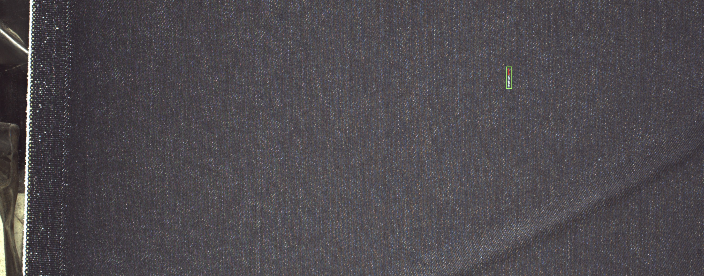
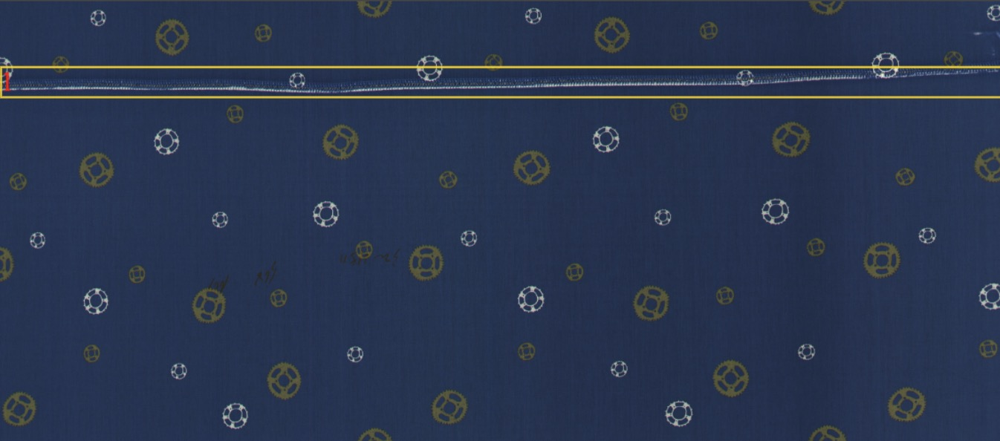

# 广东工业智造大赛--赛场一 布匹瑕疵检测

# Guangdong Industrial Intelligent Manufacturing Contest--Stage 1


> ​	**这是我第一次参加天池的大赛，半决赛的代码开源在了final_commit文件夹里面包含了填鸭的代码，第一版的填鸭，计算了patch块的相似度。第二版的我们对小目标（1-4）类的随机3-5倍的放大。**
> ​	**1.半决赛的Rank：34/100**
> ​	**2.线下的map：60%左右，线上的map：40%左右**
>

> This is the first time I participated in the Tianchi competition. The semi-final code is open sourced. The final_commit folder contains the code for duck filling. In the second version, we zoomed in randomly 3-5 times on the small target (1-4). 
>
> 1. Rank of semi-final: 34/100 
>
> 2. Offline Map: about 60%, online map: about 40% 


### 数据(Data)





# 总结一下(Summary)：

1. **特征工程** 

2. **选用模型** 

3. **训练，调参**

4. **提交结果**

   ***开始做的时候，我们是先出了一个baseline的结果，开始我是自己一个人玩，直接上faster-rcnn-r101 map：26% 有点沮丧***
   ***毕竟这时候还在忙着写（水）论文，后来论坛里 开源了一个cascade-rcnn-r50的模型。初赛52%map。***
   ***根据这个baseline，我换了backbone r101 居然：54%map，嘻嘻...这里直接就进了60多*。**

   > Feature engineering 
   >
   > 2. ** Selection model **
   >
   > 3. ** Training and Tuning **
   >
   > 4. ** Submission Results **
   >
   >     **When we started, we first produced a baseline result. At the beginning, I played by myself, and went directly to the faster-rcnn-r101 map: 26% a bit frustrated **
   >     **After all, at this time, I was still busy writing a (water) dissertation. Later, a cascade-rcnn-r50 model was open sourced in the forum. 52% map for the preliminary round. **
   >     **According to this baseline, I changed the backbone r101: 54% map,  ... more than 60 directly entered here .**

## 有用的点子(effective points)：

- anchor的设计非常重要，mmdetection的默认[0.5,1,2]一般来说很难符合数据的特性，所以这里是提分的点子
- fpn层 dcn （槽点，太吃显存，因为要用很多的offsets）
- OHEM 在线困难样本的发掘
- soft-nms 提分不多，大概一个点左右（大概率是0.几%哈~）
- TTA 老版本的mmdet没有TTA 多尺度测试，新版的有
- 填鸭，对于正常样本的利用。这里其实跟我写论文里的东西有点像，来自小样本增强的那篇论文，但是有个问题就是容易引入结构化的噪声，这里需要计算 patch的块的相似度---于是乎（度娘了一下），用了现成的
-  GN+ws （分组Normalize）
- rpn 调参 

> -The design of the anchor is very important. The default [mm, detection] of mmdetection is generally difficult to meet the characteristics of the data, so here is a point to improve
>
> fpn layer dcn (slot, too much video memory, because a lot of offsets are used)
>
> Discovery of OHEM online difficult samples
>
> Soft-nms does not improve much, about one point (large probability is 0. several% ha ~)
>
> -TTA old version of mmdet does not have TTA multi-scale test, new version 
>
> Duck filling, use of normal samples. This is actually a bit like what I wrote in the paper, from the paper with small sample enhancement, but there is a problem that it is easy to introduce structured noise. Here you need to calculate the similarity of the patch blocks-so it ’s (Baidu  (google) A little bit), using ready-made
>
> GN + ws (group Normalize)
>
> rpn tuning

## 一些试过但是没有用的(useless):

- 打算切图做的，cascade-r50对512*512的图像来测试，对于1-4好像有点效果，可能是可视化的错觉吧

- 分类的模型，这时候就做的比较晚，用了 20层的 只有40多的Acc

> -I plan to cut the picture. Cascade-r50 tests on 512 * 512 images. It seems to be a bit effective for 1-4 classes. It may be a visual illusion.
>
> -The classification model, which was done relatively late at this time, used 20 layers and only had more than 40 Acc+

## 还没有尝试的(Haven't tried)：
- ## GIOU loss

- ## GMloos GMHRLoss

- ## Focal loss

- ## mixup、smooth label

- ## Cosine annealing learning rate decay


## 定制化的框架（可能是我没有仔细阅读过mmdet的源码）：

## Customized framework (maybe I haven't read the mmdet source code carefully)

- **其实需要魔改框架的，加入一些对小目标增强的结构**
- ** In fact, it is necessary to magically change the framework, and add some structures that enhance small goals **

#  关于训练时多目标（200+）爆显存

## About multi-target (200+) explode memory during training

- **参考上传的 transform.py 替换 mmdet的同名文件**
- ** Refer to uploaded transform.py to replace mmdet's file with the same name **


## Installsion


1. Install

   ​      Fellow the mmdetection install.md

2. Data format

   ​       In my experiment **COCO, VOC** changed by yourself!

3. COCO pretrained model transfer

   ​	The transfer code in checkpoints num_class should modify your class. Notice!!! **scale and ratios** changed, I use a simple cat method for suitable model struct param avoid parameters initialize problem!

## Training

```python3
python3 configs/cascade_rcnn_r101_fpn_1x_with_coco.py  --gpus 1 work_dir XXXXXX(your path to save model and train log)
```

## Test

```
python3 cascade_rcnn_r101_fpn_1x_test_coco.py
```

## Acknownledgement:

​	Thanks TianChi for holding this competition https://tianchi.aliyun.com/

​	Thanks Openbyes provide computing power support https://openbayes.com/

​	Thanks Team member Chen and Li give valuable advice

## 如果你有什么问题，欢迎提 issue！

## If you have any questions, welcome to issue!

Email：iloveitre@gmail.com